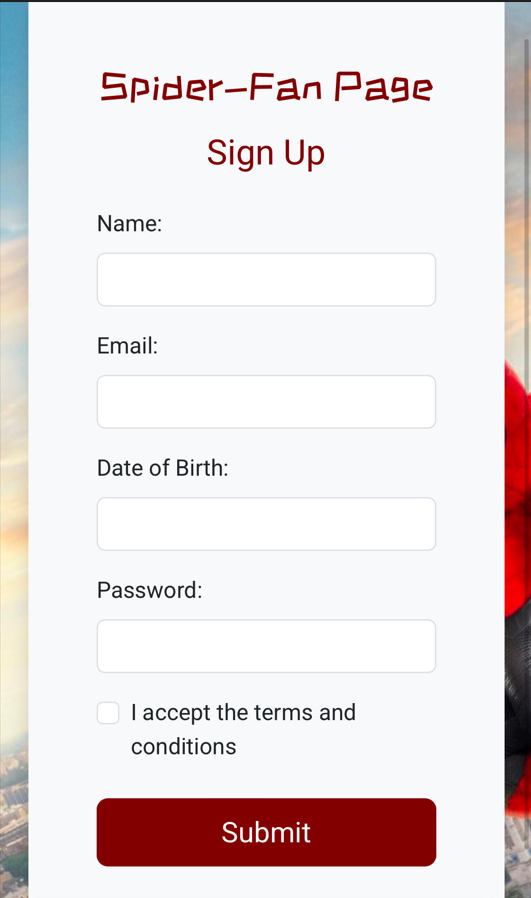

# SpiderFanPage

A responsive fan page sign-up form inspired by Spiderman. Built using HTML, CSS, Bootstrap and JavaScript

# Features

- Custom sign-up form with validation included for name, email, DOB and password
- Bootstrap styling with ZCOOL KuaiLe and Roboto fonts
- User-friendly error handling and sign-up success message ("Welcome to the Spider-Verse!")
- Fully responsive layout for mobile and desktop

# Tech Used

- HTML5
- CSS3
- Bootstrap 5
- Vanilla JavaScript

## Live Demo

[https://katiec97.github.io/SpiderFanPage/]

## Screenshots

### Desktop View

### Mobile View

